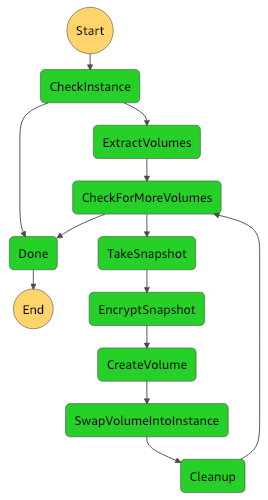
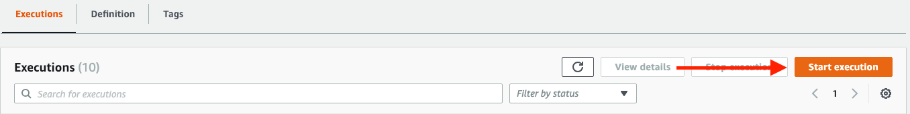

# EC2Cryptomatic (server-less version)

Encrypt EBS volumes from AWS EC2 instances with a serverless StepFunctions machine.
This project is a server-less version of the EC2Cryptomatic tool (http://www.github.com.jbrt/ec2cryptomatic).

**Non-serverless version of EC2Cryptomatic can encrypt larger EBS volumes.** 
If you need to encrypt large volumes please use the non-serverless version.

## Description

This tool let you :
- Encrypt all the EBS volumes for an instance
- Duplicate all the source tags to the target
- Apply DeleteOnTermination flag if needs
- Preserve the original volume or not as an option 
- Start each instance after encrypting is complete

For your information, the workflow used to encrypt a EBS volume is:
- Take a snapshot from the original volume
- Copy and encrypt that snapshot
- Create a new volume from that encrypted snapshot
- Swap the volumes
- Do some cleaning

All logs will be sent to CloudWatch Logs.

## How it works ?

This version of the ec2cryptomatic tool used Lambda functions and a Step 
Functions machine for encrypting volumes.

 

## How deploy it ?

This project embedded a Terraform template that let you deploy the state 
machine into your AWS account.

Please download the terraform tool from http://www.terraform.io and then
use these commands into the terraform directory of this project:

````bash
terraform init
terraform plan
terraform apply
````

## How to run the Step-Functions machine ?

Go into your Step-functions console, click on EC2Cryptomatic-state-machine.
Then click on "Start Execution":



Finally, you can use this JSON structure as input parameters:

```json
{
    "region": "eu-west-1",
    "instance_id": "i-069131dace36da0f7",
    "kms_key": "alias/aws/ebs",
    "delete_source": true
}
```

You can also use the AWS CLI for starting the machine :

````bash
aws stepfunctions start-execution --state-machine-arn <value>
                                  [--name <value>]
                                  [--input <value>]
                                  [--cli-input-json <value>]
                                  [--generate-cli-skeleton <value>]
````

## License

This project is under MIT license.

